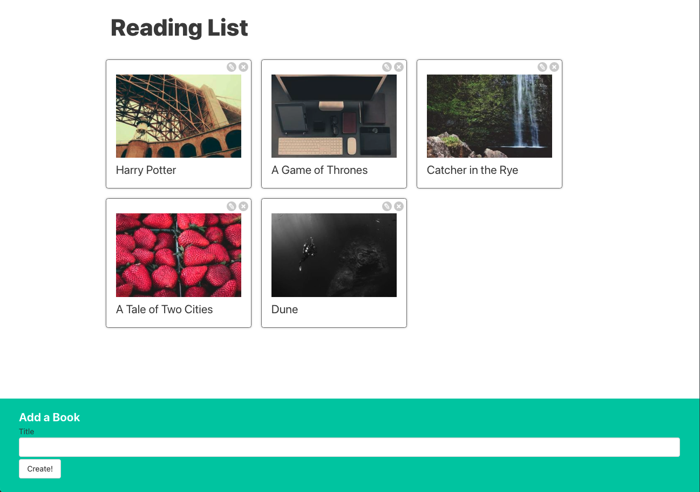

# Books - React 

  ## Description
  Books is a simple React.js application to create, update, and delete book titles using the React state system and props. Data is saved to a json file using the json-server NPM package.

  This app has been refactored to use REACT Context.

  Screenshot:

  
  
  ## Table of Contents
  
  - [Installation](#installation)
  - [Usage](#usage)
  - [License](#license)
  - [Contributing](#contributing)
  - [Tests](#tests)
  - [Questions](#questions)
  
  ## Installation
  
  Type 'npm run start' to start REACT server on localhost port 3000, and 'npm run server' in a separate terminal to run the json-server (which is used to save books that have been created/updated).
  
  ## Usage
  
  Enter a book title to create a new book card, click edit button to update the title and click on the delete button to delete the book.

  ## License
This application is covered under the MIT License.
 For more information: https://opensource.org/licenses/MIT
  
  ## Contributing
  N/A
  
  ## Tests
  N/A

  ## Questions
  Contact Info 
  GitHub user name: BillStephens2022 
  Link to GitHub profile: https://github.com/BillStephens2022 
  Email: stephensbill17@gmail.com

